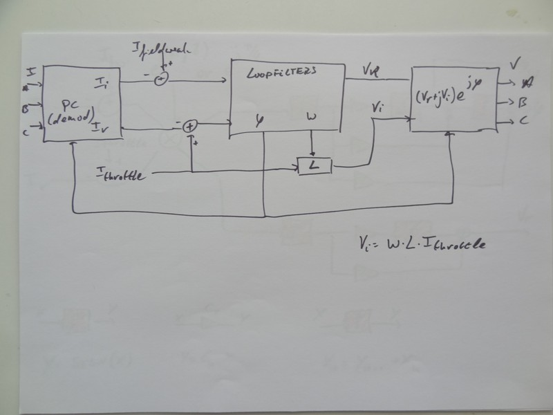
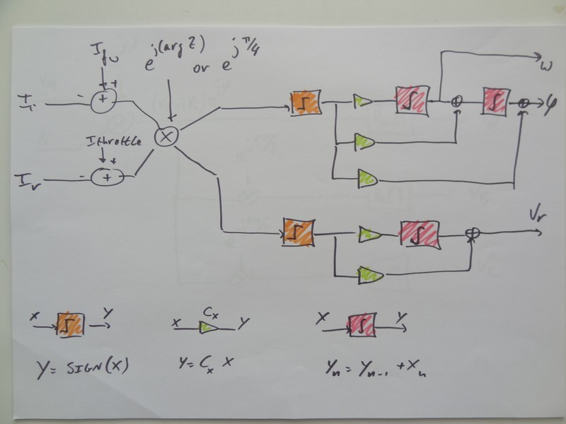
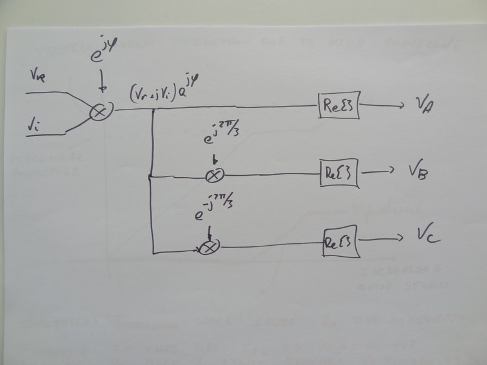
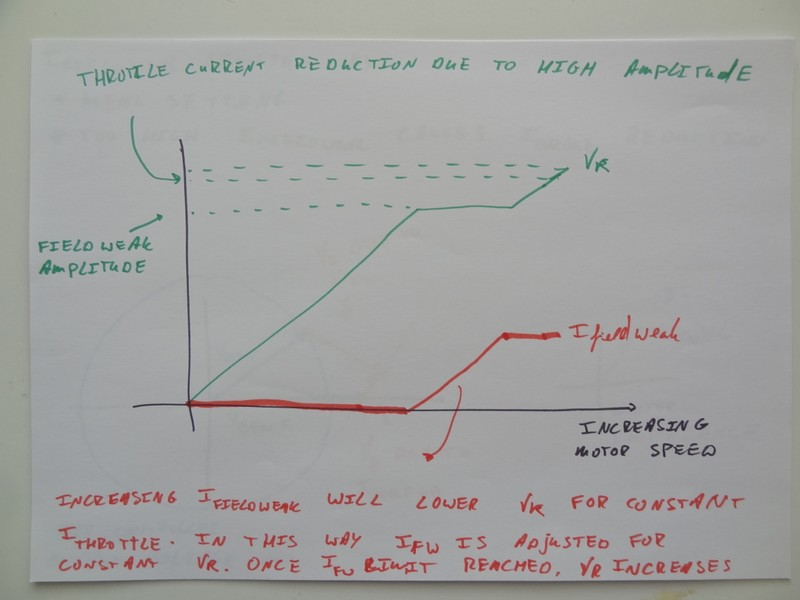
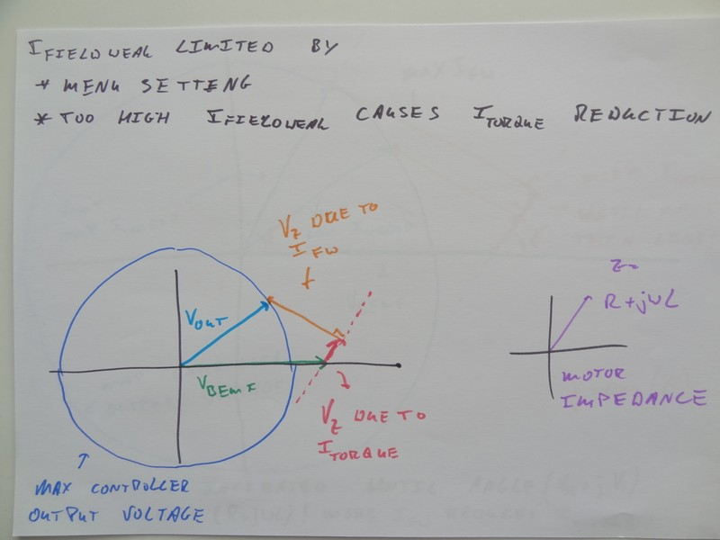
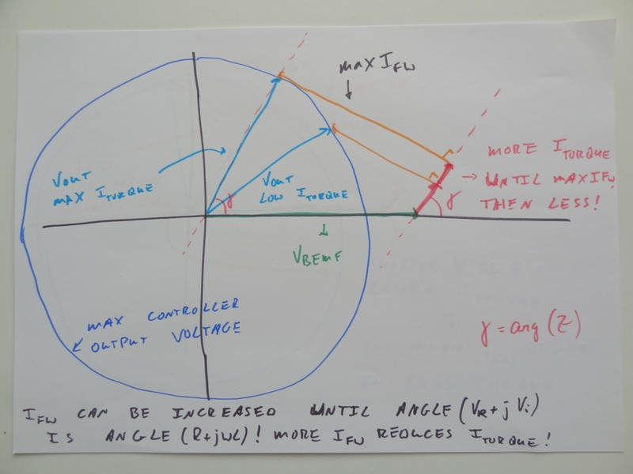
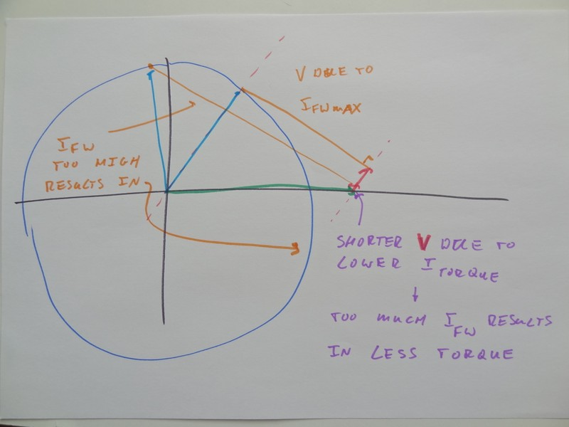

# About Lebowski controller IC firmware
This is an archive of the Lebowski controller IC 2.A1 source code and (short) explanation [as shared on endless-sphere forum](https://endless-sphere.com/forums/viewtopic.php?p=1533403&sid=e2e5ab24d0e911ac110ec6a7a4b55f2a#p1533223):

You can [view the source code here](https://github.com/OpenSource-EBike-firmware/Lebowski-controller-IC/tree/master/src/Lebowski_2A1/30F_powerstart_v2pA1.X) or [download the original ZIP file here](https://github.com/OpenSource-EBike-firmware/Lebowski-controller-IC/raw/master/src/Lebowski_2A1.zip).

# Original notes shared on forum

In essence the sensorless part of the controller is a Stator Oriented Controller but with an added shift in the output stage to make it a Field Oriented Controller.

A Stator Oriented Controller works on a simple principle: to get maximum power at the stator point of view the voltage vector must align with the current vector. The voltage vector is known as this is the voltage at the output of the controller. The controller generates this itself so it knows the vector location. The current vector is also known as this is measured with current sensors in the controller output lines. This is a pure electrical view of getting max power, no knowledge magnetic fields, motor construction or motor properties is necessary for this.

All calculations are done on the stator level. Only at the last stage in the output section a 90 degree voltage shift is added. This shift is calculated based on 2 * pi * I_throttle * L_motor (assuming no fieldweakening). This shift moves the controller output voltage ahead of the motor current, making it a Field Oriented Controller. Again, from a pure electrical point of view this is all that is necessary to get max power.

Maximum power is achieved when the current is aligned with the RECEIVING voltage source. So for generating mechanical power the current is aligned with the motor BackEMF (by means of adding the 90 degree shifted inductor voltage from the previous paragraph). For regen however the receiving voltage is the stator voltage, so for regen the 90 degree shifted voltage is not added and the controller operates as a Stator Oriented Controller. This gives less than maximum (braking) torque, but does give maximum current back into the battery (max regen efficiency).

The picture above shows the block diagram for sensorless mode (drive 3). On the left is the conversion from the 3 motor currents to the current vector (in the complex domain, I_r +j*I_i , r stands for real, i stands for imaginary, j is the sqrt(-1)) . In standard literature this is both the Clarke and Park transform in one (when this code was written I didn't know about Clarke and Park..) . This then goes into the loop filters. The output of the loop filters is motor speed (omega in the picture, phi_int in the code), motor phase (phi_motor in the code) and output amplitude (ampli_real in the code). The for FOC necessary voltage shift is directly calculated based on omega*L*I_throttle and placed in ampli_imag in the code. Then on the right the output block calculates the three motor voltages.

There is no observer or anything like that (I actually dont know what that is). Underneath the loopfilter block and output block are further explained.

The loopfilters is where things get interesting. The loopfilter part for phase and speed is based on a PLL and contains 2 integrators. The loopfilter part for amplitude (the real part V_r of the amplitude) is a simple first order loopfilter containing only 1 integrator.

The inputs of this block is based on the errors in the motor currents. The loopfilters however directly control the controller output voltages. To make the translation from currents to voltages, a multiplication with the (phase of the) motor impedance is included before the actual loop filters. Ideally the phase of the motor impedance is used here, but if unknown then 45 degrees is also good. The impact of adding this rotator is very interesting. It links both phase and amplitude together. At low speed (where the rotator rotates over 0 degrees as motor impedance is dominated by R) an error in phase results in action taken by the phase control loop, and an error in amplitude is dealt with by the amplitude control loop. But at high speed where the motor L impedance is much higher than motor R, so the rotator rotates over 90 degrees. This means that errors in phase are dealt with by the AMPLITUDE control loop, and error in current amplitude is dealt with by the PHASE control loop. A 'golden', always good phase to rotate over is 45 degrees.

Lastly, before the loopfilters simple quantisers are added. These generate a simple +1 or -1 output based on the sign of their input signals. The effect of these is that the control loops are like Sigma Delta converter control loops, not the more standard PID etc. The quantizers are in series with the unknown motor integrator. Because of the adaptive gain inherent in quantizers (see Sigma Delta theory) this makes the control loops independent of the motor R and L (and this is the reason why Arlo1's Nissan Leaf motor runs with the same control loop coefficients as my 4025 low inductance small RC motor). In laymans terms, the motor L and R determines the amplitude of the signals going into the quantizers. But since the quantizers only output +1 or -1, the size of the signals going into the quantizers does not matter. And therefore motor L and R does not matter. In technical terms, in 1 bit Sigma Delta theory it is known that the single integrator in the control loop representing the 1st order does not matter, its properties ONLY determine the amount of quantisation noise in the loop but it does not impact loop stability. Here the motor L and R are the single integrator representing the 1st order, so therefore the motor properties determine the amount of quantisation noise BUT NOT THE LOOP STABILITY.

Lastly the output voltages for the 3 output phases are calculated. I do not use SVM or anything like that, each phase is calculated independently of the other 2. Simple 1st order noise shapers are used to deal with the quantisation inherent in the PWM process. The output amplitude of the loop filter (V_r) together with the inductor based (no fieldweakening) voltage shift (V_i) is rotated over motor phase phi . Then controller output phase A is the real part of this complex voltage. For phase B the complex voltage is rotated 120 degrees forward and the real part is taken. For phase C a rotation over -120 degrees is applied.

What you have to realise is that running a motor is a 2-dimensional control problem. In a simple sensored FOC motor phase is known and the 2-dimensional control determines the real and imaginary output voltage, based on real and imaginary wanted motor current. For sensorless FOC the imaginary output voltage is known (calculated from motor inductance, throttle current and rotor speed), the 2 dimensional control determine the rotor phase and real output voltage (again based on wanted motor current)

The control is thus always based on wanting 2 variables, namely the motor real current (throttle current) and motor imaginary current (fieldweak current) . To be able to influence these 2 independent variables you NEED to be able to independently control 2 motor controller output variables. For sensorless these 2 independent motor controller output variables are the real amplitude and rotor phase. You CANNOT let the real amplitude run into the limiter ! At that point you only have one control variable left (the phase) and you CANNOT independently influence the 2 input wanted current anymore. You absolutely NEED TWO independent output control variables to be able to control TWO wanted input variables !

To prevent saturation of the output voltage (and thus losing one independent output variable) a scheme was put in place where an increase in output amplitude automatically reduces the throttle current. In such a way the controller will never saturate and you will always have TWO independent control variables available.

Just before the output voltage limiter starts reducing the throttle current the field weakening kicks in. I think the default for the output voltage limiter to kick in is 98% of max amplitude, while the default for the field weakening is 95%. So once the amplitude exceeds the 95% level the controller automatically starts to ask for (more) field weakening current. The effect of asking for more field weakening current is that the output voltage is automatically reduced (as due to the field weakening the wanted torque current can be achieved for a lower output voltage). The net effect of this is that the output voltage is stuck at 95% while the field weakening current is increased.

Once certain conditions apply and no more field weakening can be applied, the controller output voltage will increase above 95%. Then once it exceeds 98% the wanted torque current will automatically be reduced until a stable operating point is achieved. During this whole process there will always be 2 output variables available to control 2 input variables.

Now the amount of field weakening current you can apply is not an arbitrary thing. On the one hand there is the maximum you want to set based on max phase current, max battery current etc. This is the value entered in the menu structure, where I recommend 0A if you want no field weakening (it will just pass the 95% level without applying field weakening) or 70% of max phase amps if you do want field weakening. The thing is though that if you apply TOO MUCH field weakening the motor will actually SLOW DOWN !! There is a second condition determining the max field weakening current that you can apply !

In the above picture the blue circle represents all possible max output voltages the controller can generate. In the above picture in this particular case the controller output voltage is the light blue voltage vector V_out. The motor voltage is the green vector (along the real axis) V_bemf. Notice that this voltage is larger than the controller can generate. On top of the green motor voltage vector you have the pink motor impedance voltage vector as caused by the real motor current I_torque. This vector is somewhere along a line (dotted pink) at an angle determine by the motor impedance (in purple). Finally the orange voltage vector is the motor impedance combined with the imaginary motor current I_fieldweak. This orange vector is always at a 90 degrees angle with the pink vector. Note that the sum of motor V_bemf (green vector) and motor impedance voltage (pink and orange vectors) ALWAYS adds up to the controller output voltage vector (light blue) and that this is ALWAYS on the dark blue circle of max possible output voltages.

Increasing the field weakening curent I_fieldweak means an increase in lenght of the orange voltage vector. This causes a move of the light blue controller output voltage vector along the dark blue circle of max possible voltages. In this way the pink voltage vector is stretched out, meaning a higher I_torque is achieved. This then in turn means more motor torque and probably a higher motor speed.

But you can see from the picture that there is a maximum. There is a clear tipping point where the sum of light blue vector and orange vector leads to a maximum length of the pink vector.

Increasing the orange vector will lead to a decrease of pink vector. Meaning more field weakening current will actually lead to a reduction in torque current.

The limit for the length of the orange vector is there where the angle of the light blue vector is that of the pink vector. Or: the limit for the fieldweakening current is there where the angle of the controller output voltage vector is that of the motor impedance.

So the controller increases the field weakening current to try to maintain the 95% output voltage level. All the while it observes the controller output voltage angle and compares this to the motor impedance angle. If the voltage angle exceeds the impedance angle it will stop increasing the field weakening current. This is a dynamic process as there are constant changes in motor speed (changes the impedance angle !) and motor controller output voltage vector (remember that this is controlled by the 2 control loops on which the field weakening has no impact).

This is the reason that the actually applied field weakening current is typically less than the set maximum, is constantly changing and in practise is difficult to predict.

Two improvement suggestions based on comments received:

- For the rotation in the loopfilters (from current to voltage, as explained above) it always uses the motor impedance angle. When this angle is wrong the controller can go unstable under high load. For this reason Arber333 and Arlo1 had to experiment with motor inductance / resistance for the controller to be stable. My experience is that not using the motor impedance angle but using a fixed 45 degree angle is ALWAYS stable. The drill with the Sensorless From Standstill was using 45 degree for the rotation, and not the motor impedance. I would add a menu option where one can chose between impedance angle and fixed 45 degree angle.

- In the fieldweakening post I discuss how the amplitude of the controller output voltage kickstarts fieldweakening and ultimately torque current limiting. In the current implementation a shortcut is taken where it only looks at the real part of the motor output voltage for this. Better is to use the actual voltage vector lenght, so using both real and imaginary parts.... This is my best guess why Arlo1's car used to sometimes conk out at high speed under field weakening.
